# TM Governance: KRI-to-KPI Diagnostic Mapping, Column Schemas & Narrative Stories

This reference document provides the definitive mapping between **Key Risk Indicators (KRIs)**, supporting **Key Performance Indicators (KPIs)**, exact **Excel table schemas**, and **plain-English narrative story templates** for Transaction Monitoring (TM) Model Governance.

---

## 1. Quarter Format Standards & Resolution Lifecycle

### A. Strict Standard Quarter Format: `Q{N}_{YYYY}`
All quarterly columns in the Excel workbooks follow a strict, standardized naming convention:
- **Format**: `Q{N}_{YYYY}` (Capital `Q`, quarter number `1-4`, underscore `_`, 4-digit year `YYYY`).
- **Examples**: `Q1_2025`, `Q2_2025`, `Q3_2025`, `Q4_2025`, `Q1_2026`.
- **Monthly Format**: `YYYY-MM-01` (e.g., `2025-07-01`, `2025-08-01`, `2025-09-01`).

### B. Quarter Resolution Chain
Given an input **Ingestion Quarter** provided during a governance cycle:
1. **Ingestion Quarter ($Q_{\text{ingestion}}$)**: The active reporting period (e.g., `Q1_2026`).
2. **Test Quarter ($Q_{\text{test}}$)**: The evaluation period under test, resolved as **2 quarters prior** to ingestion ($Q_{\text{ingestion}} - 2$ quarters, e.g., `Q3_2025`).
3. **Base Quarter ($Q_{\text{base}}$)**: The comparative baseline quarter, resolved as **3 quarters prior** to ingestion ($Q_{\text{ingestion}} - 3$ quarters, e.g., `Q2_2025`).
4. **Benchmark Quarter ($Q_{\text{bench}}$)**: The certified deployment baseline ($Q_{\text{base}} > Q_{\text{bench}}$, e.g., `Q1_2023`).

```text
┌──────────────────────────────────────────────────────────────────────────────────────────────────┐
│                                 QUARTER RESOLUTION LIFECYCLE                                     │
├──────────────────────────┬──────────────────────────┬────────────────────────┬───────────────────┤
│    Benchmark Quarter     │       Base Quarter       │      Test Quarter      │ Ingestion Quarter │
│         Q_bench          │     Q_base (Ing - 3)     │    Q_test (Ing - 2)    │   Q_ingestion     │
│   e.g. Q1_2023 (Deploy)  │   e.g. Q2_2025 (Base)    │   e.g. Q3_2025 (Eval)  │ e.g. Q1_2026 (Now)│
└──────────────────────────┴──────────────────────────┴────────────────────────┴───────────────────┘
```

---

## 2. KPI Catalog: Definitions, Schemas & Plain-English Story Templates

Every KPI is documented below with its formal definition, exact Excel sheet and dynamic column location (`Q{N}_{YYYY}` / `YYYY-MM-01`), and an **Executive Narrative Story Template** that translates raw numbers into intuitive business context.

---

### KPI 1: Number of Alerts (Gross Alert Volume)
* **Purpose**: Measures the gross scale of alert generation activity for an Alert Definition during a reporting period.
* **Formula**:
  $$\text{KPI 1} = \text{Count of Alerts}$$
* **Source Sheet**: `KPI_1`
* **Target Columns**:
  - Test Quarter Volume: Dynamic column `Q{N}_{YYYY}` matching $Q_{\text{test}}$ (e.g., `Q3_2025`).
  - Monthly Breakdown: Dynamic columns `YYYY-MM-01` matching $Q_{\text{test}}$ months (e.g., `2025-07-01`, `2025-08-01`, `2025-09-01`).
* **Executive Story Template**:
  > *"During Q3_2025, this Alert Definition generated a total of **{Q3_2025_value} alerts** (compared to **{Q2_2025_value} alerts** in base quarter Q2_2025), with a monthly trajectory of {M1_val} in Jul, {M2_val} in Aug, and {M3_val} in Sep."*

---

### KPI 2b: Number of Alerted Customers (Customer Coverage)
* **Purpose**: Measures the unique number of distinct customers that triggered alerts during the period, providing insight into customer breadth versus repeat alert concentration.
* **Formula**:
  $$\text{KPI 2b} = \text{Count Distinct}(\text{Customer ID})$$
* **Source Sheet**: `KPI_2b`
* **Target Columns**:
  - Test Quarter Unique Customers: Dynamic column `Q{N}_{YYYY}` matching $Q_{\text{test}}$ (e.g., `Q3_2025`).
  - Base Quarter Comparison: Dynamic column `Q{N}_{YYYY}` matching $Q_{\text{base}}$ (e.g., `Q2_2025`).
* **Executive Story Template**:
  > *"A total of **{Q3_2025_value} unique customers** triggered alerts in Q3_2025. With {KPI_1_value} total alerts, this represents an average of **{KPI_1_value / Q3_2025_value:.1f} alerts per customer**, indicating whether alert volume is broadly distributed across the portfolio or concentrated among a few repeat entities."*

---

### KPI 3: Number of Productive Customers (Level 3 Escalated Entities)
* **Purpose**: Measures the number of unique customers associated with productive alerts that were escalated to Level 3 (L3) compliance review / SAR filing.
* **Formula**:
  $$\text{KPI 3} = \text{Count Distinct}(\text{Customer ID where LOD} = \text{L3})$$
* **Source Sheet**: `KPI_3`
* **Target Columns**:
  - Test Quarter Productive Customers: Dynamic column `Q{N}_{YYYY}` matching $Q_{\text{test}}$ (e.g., `Q3_2025`).
  - Base Quarter Comparison: Dynamic column `Q{N}_{YYYY}` matching $Q_{\text{base}}$ (e.g., `Q2_2025`).
* **Executive Story Template**:
  > *"In Q3_2025, **{Q3_2025_value} distinct customers** generated alerts that were confirmed as productive and escalated to Level 3 investigation (compared to **{Q2_2025_value} productive customers** in Q2_2025)."*

---

### KPI 4b: Upstream Transaction Volume & Population
* **Purpose**: Measures changes in underlying customer population and transaction flow volume over time.
* **Formula**:
  $$\text{KPI 4b} = \text{Total Processed Transactions / Eligible Customer Population}$$
* **Source Sheet**: Ingestion metadata / `parsed_acd` (`ATL_pop`) / `country_stats` (`number_of_unique_customers_count`).
* **Executive Story Template**:
  > *"The total eligible monitored customer population stood at **{pop_count} active accounts** in Q3_2025, confirming that alert volume shifts reflect organic underlying banking activity rather than data pipeline defects."*

---

### KPI 6: First Productive Alert Position from Threshold
* **Purpose**: Identifies how close the earliest productive (L3 escalated) alert was to the configured threshold floor. Lower percentiles indicate high threshold sensitivity.
* **Formula**:
  $$\text{KPI 6} = \text{Min Percentile Rank of Productive Alerts relative to Threshold Floor}$$
* **Source Sheet**: `KPI_6` / `KRI_3` (`first_productive_percentile_position`)
* **Target Columns**:
  - Test Quarter Position: Dynamic column `Q{N}_{YYYY}` matching $Q_{\text{test}}$ (e.g., `Q3_2025`).
* **Executive Story Template**:
  > *"The earliest productive alert occurred at the **{Q3_2025_value * 100:.1f}th percentile** of the alert distribution above the threshold floor. A value close to 0% confirms that productive risk is tightly stacked immediately above the current boundary."*

---

### KPI 11: False Positive Ratio (%)
* **Purpose**: Measures the proportion of generated alerts that were closed without escalation, reflecting operational efficiency and investigator noise.
* **Formula**:
  $$\text{KPI 11} = \frac{\text{Total Alerts} - \text{Productive Alerts}}{\text{Total Alerts}} \times 100$$
* **Source Sheet**: `KPI_11` / `KPI_17_quarter` (`false_positive_rate`)
* **Target Columns**:
  - Test Quarter FP Rate: Dynamic column `Q{N}_{YYYY}` matching $Q_{\text{test}}$ (e.g., `Q3_2025`).
* **Executive Story Template**:
  > *"In Q3_2025, **{Q3_2025_value:.1f}% of all alerts** were determined to be false positives and closed at L1/L2 triage without requiring escalation."*

---

### KPI 12: True Positive Ratio (%) / Productive Alert Rate
* **Purpose**: Measures the proportion of generated alerts that resulted in productive outcomes (L3 escalations / SAR filings).
* **Formula**:
  $$\text{KPI 12} = \frac{\text{Productive Alerts}}{\text{Total Alerts}} \times 100$$
* **Source Sheet**: `KPI_12`
* **Target Columns**:
  - Test Quarter TP Rate: Dynamic column `Q{N}_{YYYY}` matching $Q_{\text{test}}$ (e.g., `Q3_2025`).
* **Executive Story Template**:
  > *"The model achieved a **True Positive conversion rate of {Q3_2025_value:.1f}%** in Q3_2025, demonstrating the proportion of alerts that successfully identified suspicious financial crime activity."*

---

### KPI 15a: Productive Alerts Within Amount Threshold Proximity (%)
* **Purpose**: Measures the proportion of productive alerts occurring within a predefined proximity window along the transaction amount threshold dimension.
* **Formula**:
  $$\text{KPI 15a} = \frac{\text{Amount Proximity Productive Alerts}}{\text{Total Productive Alerts}} \times 100$$
* **Source Sheet**: `KPI_15a` / `KRI_3` (`test_quarter_accum_ratio_amount`)
* **Target Columns**:
  - Test Quarter Amount Proximity: Dynamic column `Q{N}_{YYYY}` matching $Q_{\text{test}}$ (e.g., `Q3_2025`).
* **Executive Story Template**:
  > *"In Q3_2025, **{Q3_2025_value:.1f}% of all productive alerts** clustered tightly within the threshold proximity window along the Amount boundary, indicating strong sensitivity to transaction value cutoffs."*

---

### KPI 15b: Productive Alerts Within Frequency Threshold Proximity (%)
* **Purpose**: Measures the proportion of productive alerts occurring within a predefined proximity window along the transaction frequency/count threshold dimension.
* **Formula**:
  $$\text{KPI 15b} = \frac{\text{Frequency Proximity Productive Alerts}}{\text{Total Productive Alerts}} \times 100$$
* **Source Sheet**: `KPI_15b` / `KRI_3` (`test_quarter_accum_ratio_freq`)
* **Target Columns**:
  - Test Quarter Frequency Proximity: Dynamic column `Q{N}_{YYYY}` matching $Q_{\text{test}}$ (e.g., `Q3_2025`).
* **Executive Story Template**:
  > *"In Q3_2025, **{Q3_2025_value:.1f}% of all productive alerts** clustered tightly within the proximity window along the Frequency/Count boundary."*

---

### KPI 16: Number of Productive Alerts (L3 Escalation Count)
* **Purpose**: Measures the absolute count of productive alerts escalated to Level 3 compliance review.
* **Formula**:
  $$\text{KPI 16} = \text{Count of Productive Alerts (LOD = L3)}$$
* **Source Sheet**: `KPI_16` / `KRI_2` (`test_quarter_count`) / `KRI_3` (`productive_alerts_count`)
* **Target Columns**:
  - Test Quarter Productive Alerts: Dynamic column `Q{N}_{YYYY}` matching $Q_{\text{test}}$ (e.g., `Q3_2025`).
  - Base Quarter Comparison: Dynamic column `Q{N}_{YYYY}` matching $Q_{\text{base}}$ (e.g., `Q2_2025`).
* **Executive Story Template**:
  > *"The Alert Definition generated **{Q3_2025_value} productive alerts** in Q3_2025 (compared to **{Q2_2025_value} productive alerts** in Q2_2025)."*

---

### KPI 17: Unique Productivity Within Typology (Overlap & Redundancy)
* **Purpose**: Evaluates productive yield attributable uniquely to this model after removing multi-AD typology overlap.
* **Formula**:
  $$\text{KPI 17} = \text{Unique Productive Alerts after Typology De-duplication}$$
* **Source Sheet**: `KPI_17` (Time Series `metric` rows) / `KPI_17_quarter`
* **Target Columns**:
  - `KPI_17`: Dynamic column `Q{N}_{YYYY}` matching $Q_{\text{test}}$ (e.g., `Q3_2025`).
  - `KPI_17_quarter`: `general_overlap_ratio`, `prod_general_overlap_ratio`, `typology_top_overlapping_AD_prod_alerts`.
* **Executive Story Template**:
  > *"This Alert Definition shares a **{prod_general_overlap_ratio * 100:.1f}% productive overlap** with sibling control **{typology_top_overlapping_AD_prod_alerts}**, generating **{unique_tp_alerts_count_within_typology} unique productive alerts** that are not captured by any other rule in the typology."*

---

### KPI 18: Secondary Configuration Parameters & Proximity Distances
* **Purpose**: Evaluates productive cases against secondary limits (ratios, profile multipliers, z-scores, velocity increases).
* **Source Sheet**: `KPI_18_quarter`
* **Target Columns**:
  - Distance to Min Ratio: `abs_distance_first_tp_and_min_ratio_threshold`
  - Distance to Profile Threshold: `abs_distance_of_the_min_tp_average_amount_and_profile_min_threshold_value`
  - Distance to Z-Score Limit: `abs_distance_first_tp_and_zscore_threshold`
* **Executive Story Template**:
  > *"The closest productive alert was positioned at a mathematical distance of **{abs_distance}** from the secondary threshold limit ({param_name} = {param_val}), confirming parameter boundary responsiveness."*

---

## 3. Comprehensive KRI-to-KPI Column Level Mapping

```mermaid
graph TD
    K1[KRI 1: Alert Volume Shift] --> KPI1[KPI 1: Q_test Alert Count]
    K1 --> KPI2b[KPI 2b: Q_test Alerted Customers]
    K1 --> KPI11_12[KPI 11 / 12: FP & TP Ratios]
    K1 --> CSTAT[country_stats: Open Alert Ratio]

    K2[KRI 2: True Positive Decay] --> KPI16[KPI 16: Q_test Productive Alerts]
    K2 --> KPI3[KPI 3: Q_test Productive Customers]
    K2 --> KPI17Q[KPI 17_quarter: Overlap Ratios]

    K3[KRI 3: Proximity Accumulation] --> KPI15[KPI 15a/b: Amount & Freq Proximity %]
    K3 --> KPI6[KPI 6: 1st Productive Position]
    K3 --> KPI18Q[KPI 18_quarter: Secondary Distances]

    K6[KRI 6: Control Dormancy] --> KRI6S[KRI 6: Q_T, Q_T-1, Q_T-2 = 0]
    K6 --> THRESH[thresholds: Active Boundaries]
```



---

### KRI 1: Deviation in Alert Volume (Gross Alert Volatility)
* **Trigger Conditions**:
  - $1\text{--}3\sigma$ deviation + $|\Delta_{\text{vol}}| \ge 50$ (RB) / $\ge 30$ (WB) for $\ge 2$ consecutive test quarters.
  - $\ge 3\sigma$ deviation + $|\Delta_{\text{vol}}| \ge 50$ (RB) / $\ge 30$ (WB) in 1 single quarter.

| Source Sheet | Target Column Name | Format / Nature | Diagnostic Function |
| :--- | :--- | :--- | :--- |
| **`KRI_1`** | `test_quarter_count`, `base_quarter_count`, `test_base_quarter_diff` | Integer Scalar | Core volume deviation vs. baseline. |
| **`KRI_1`** | `full_period_avg(count)`, `full_period_stddev_pop(count)` | Float Scalar | Historical statistical distribution ($\mu \pm 3\sigma$). |
| **`KRI_1`** | `KRI_1_incrs_three_sigma_exceeded`, `KRI_1_incrs_with_consecutive` | Flag (`0`/`1`) | Single-quarter anomaly vs multi-quarter persistent shift. |
| **`KPI_1`** | `Q{N}_{YYYY}` (e.g. `Q3_2025`, `Q2_2025`) | Dynamic Time-Series | Point-in-time gross alert volume for test & base quarters. |
| **`KPI_1`** | `YYYY-MM-01` (e.g. `2025-07-01`, `2025-08-01`, `2025-09-01`) | Dynamic Time-Series | Monthly progression within test quarter. |
| **`KPI_2b`** | `Q{N}_{YYYY}` (e.g. `Q3_2025`, `Q2_2025`) | Dynamic Time-Series | Unique alerted customer count (Alerts/Customer ratio). |
| **`KPI_11`** | `Q{N}_{YYYY}` (e.g. `Q3_2025`) | Dynamic Time-Series | False Positive rate (%) to identify operational noise. |
| **`KPI_12`** | `Q{N}_{YYYY}` (e.g. `Q3_2025`) | Dynamic Time-Series | True Positive rate (%) to verify conversion stability. |
| **`country_stats`** | `ratio_of_open_alerts_quarterly`, `number_of_open_alerts_quarterly` | Portfolio Aggregates | Operational investigator backlog impact. |

---

### KRI 2: Deviation in True Positive Volume (Detection Capability Decay)
* **Trigger Conditions**:
  - Downward $1\text{--}3\sigma$ + drop $\ge 15$ TPs (RB) / $\ge 10$ TPs (WB) for $\ge 2$ consecutive test quarters.
  - Downward $\ge 3\sigma$ + drop $\ge 15$ TPs (RB) / $\ge 10$ TPs (WB) in 1 single quarter.

| Source Sheet | Target Column Name | Format / Nature | Diagnostic Function |
| :--- | :--- | :--- | :--- |
| **`KRI_2`** | `test_quarter_count`, `base_quarter_count`, `test_base_quarter_diff` | Integer Scalar | Absolute drop in L3 escalated alerts. |
| **`KRI_2`** | `full_period_avg(productive_alerts_count)`, `full_period_stddev_pop(productive_alerts_count)` | Float Scalar | Historical productive baseline distribution. |
| **`KPI_16`** | `Q{N}_{YYYY}` (e.g. `Q3_2025`, `Q2_2025`) | Dynamic Time-Series | Quarterly productive alert count time-series. |
| **`KPI_3`** | `Q{N}_{YYYY}` (e.g. `Q3_2025`, `Q2_2025`) | Dynamic Time-Series | Unique productive customer count (L3 entities). |
| **`KPI_12`** | `Q{N}_{YYYY}` (e.g. `Q3_2025`) | Dynamic Time-Series | Conversion efficiency rate (%) collapse. |
| **`KPI_6`** | `Q{N}_{YYYY}` (e.g. `Q3_2025`) | Dynamic Time-Series | Percentile rank shift of remaining productive alerts. |
| **`KPI_17_quarter`**| `prod_general_overlap_ratio`, `typology_top_overlapping_AD_prod_alerts` | Overlap Vector | Identifies if sibling AD captured the productive alerts. |

---

### KRI 3: Accumulation in Threshold Proximity (Boundary Sensitivity)
* **Trigger Conditions**:
  - $10\text{--}50\%$ proximity accumulation shift + $5\text{--}10$ TPs in proximity for $\ge 2$ consecutive test quarters.
  - $\ge 50\%$ proximity accumulation shift + $\ge 10$ TPs in proximity in 1 single quarter.

| Source Sheet | Target Column Name | Format / Nature | Diagnostic Function |
| :--- | :--- | :--- | :--- |
| **`KRI_3`** | `base_quarter_accum_ratio_amount`, `test_quarter_accum_ratio_amount`, `kri3_amount_deviation` | Float Scalar | Amount proximity accumulation shift. |
| **`KRI_3`** | `base_quarter_accum_ratio_freq`, `test_quarter_accum_ratio_freq`, `kri3_freq_deviation` | Float Scalar | Frequency proximity accumulation shift. |
| **`KPI_15a`** | `Q{N}_{YYYY}` (e.g. `Q3_2025`) | Dynamic Time-Series | Proportion of TPs clustered near amount threshold. |
| **`KPI_15b`** | `Q{N}_{YYYY}` (e.g. `Q3_2025`) | Dynamic Time-Series | Proportion of TPs clustered near frequency threshold. |
| **`KPI_6`** | `Q{N}_{YYYY}` (e.g. `Q3_2025`), `first_productive_percentile_position` | Dynamic Time-Series | Min percentile rank of productive alerts relative to threshold. |
| **`KPI_18_quarter`**| `abs_distance_first_tp_and_min_ratio_threshold`, `abs_distance_first_tp_and_zscore_threshold` | Distance Scalar | Mathematical proximity to secondary configuration limits. |

---

### KRI 6: Dormant Alert Definition Identification (Zero-Generation Control)
* **Trigger Conditions**:
  - Active for $\ge 3$ consecutive quarters and subsequently produces **0 alerts across 3 consecutive quarters** ($Q_T = Q_{T-1} = Q_{T-2} = 0$).

| Source Sheet | Target Column Name | Format / Nature | Diagnostic Function |
| :--- | :--- | :--- | :--- |
| **`KRI_6`** | `test_quarter_alert_count`, `test_quarter_minus_1_alert_count`, `test_quarter_minus_2_alert_count` | Integer Scalars | Confirms zero alert generation across $Q_T, Q_{T-1}, Q_{T-2}$. |
| **`KPI_1`** | `Q{N}_{YYYY}` (e.g. `Q1_2023` to `Q3_2025`) | Dynamic Time-Series | Verifies historical activity before entering dormancy. |
| **`thresholds`** | `min_threshold`, `max_threshold`, `min_frequency`, `min_percentage`, `threshold_change` | Master Config | Checks for unattainable or hyper-restrictive parameters. |
| **`overlap`** | `general_overlap_ratio`, `parent_control`, `subsequent_control` | Relational | Checks if the control is obsolete and fully superseded. |
| **`country_stats`** | `number_of_active_ads_count`, `number_of_unique_customers_count` | Summary Stat | Differentiates empty target segment from data pipeline defect. |

---

## 4. Master Cross-KRI Relevance & Column Reference Matrix

| Metric / Sheet | Specific Column / Payload Field | Target Format | KRI 1 (Volume) | KRI 2 (TP Decay) | KRI 3 (Proximity) | KRI 6 (Dormancy) |
| :--- | :--- | :--- | :---: | :---: | :---: | :---: |
| **`KRI_1` / `2` / `3` / `6`** | `test_quarter_count`, `base_quarter_count`, `test_base_quarter_diff` | Integer Scalar | **Primary** | **Primary** | **Primary** | **Primary** |
| **`KRI_1` / `2`** | `full_period_avg(*)`, `full_period_stddev_pop(*)` | Float Scalar | **Primary** | **Primary** | — | — |
| **`KRI_1` / `2`** | `*_three_sigma_exceeded`, `*_with_consecutive` | Flag (`0`/`1`) | **Primary** | **Primary** | — | — |
| **`KRI_3`** | `test_quarter_accum_ratio_amount`, `kri3_amount_deviation` | Float Scalar | — | — | **Primary** | — |
| **`KRI_3`** | `test_quarter_accum_ratio_freq`, `kri3_freq_deviation` | Float Scalar | — | — | **Primary** | — |
| **`KRI_6`** | `test_quarter_alert_count`, `test_quarter_minus_1_alert_count`, `test_quarter_minus_2_alert_count` | Trailing Counts | — | — | — | **Primary** |
| **`KPI_1`** | `Q{N}_{YYYY}` (e.g. `Q3_2025`), `YYYY-MM-01` | **Time-Series Payload** | **Primary** | Secondary | Context | **Primary** |
| **`KPI_2b`** | `Q{N}_{YYYY}` (e.g. `Q3_2025`), `YYYY-MM-01` | **Time-Series Payload** | **Primary** | Secondary | Context | Secondary |
| **`KPI_3`** | `Q{N}_{YYYY}` (e.g. `Q3_2025`), `YYYY-MM-01` | **Time-Series Payload** | Secondary | **Primary** | Context | — |
| **`KPI_6`** | `Q{N}_{YYYY}` (e.g. `Q3_2025`), `first_productive_percentile_position` | **Time-Series Payload** | — | Secondary | **Primary** | — |
| **`KPI_11`** | `Q{N}_{YYYY}` (e.g. `Q3_2025`) (False Positive Rate %) | **Time-Series Payload** | **Primary** | Secondary | Secondary | — |
| **`KPI_12`** | `Q{N}_{YYYY}` (e.g. `Q3_2025`) (True Positive Rate %) | **Time-Series Payload** | **Primary** | **Primary** | Secondary | — |
| **`KPI_15a`** | `Q{N}_{YYYY}` (e.g. `Q3_2025`) (Amount Proximity TP %) | **Time-Series Payload** | — | — | **Primary** | — |
| **`KPI_15b`** | `Q{N}_{YYYY}` (e.g. `Q3_2025`) (Frequency Proximity TP %) | **Time-Series Payload** | — | — | **Primary** | — |
| **`KPI_16`** | `Q{N}_{YYYY}` (e.g. `Q3_2025`) (Productive Alerts Count) | **Time-Series Payload** | Secondary | **Primary** | **Primary** | — |
| **`KPI_17_quarter`** | `general_overlap_ratio`, `prod_general_overlap_ratio` | Multi-Dimensional | Context | **Primary** | — | **Primary** |
| **`KPI_17_quarter`** | `unique_tp_alerts_count_within_typology`, `typology_top_overlapping_AD_prod_alerts` | Multi-Dimensional | Context | **Primary** | — | Secondary |
| **`KPI_18_quarter`** | `min_ratio_threshold`, `abs_distance_first_tp_and_min_ratio_threshold` | Multi-Dimensional | Context | Context | **Primary** | **Primary** |
| **`country_stats`** | `number_of_open_alerts_quarterly`, `ratio_of_open_alerts_quarterly` | Aggregated Stat | **Primary** | Context | — | Context |
| **`thresholds`** | `min_threshold`, `min_frequency`, `threshold_change`, `benchmark` | Master Config | **Primary** | **Primary** | **Primary** | **Primary** |
| **`parsed_acd`** | `lod`, `case_status_(l1..l3)`, `l1..l4`, `final_status`, `ATL_pop` | Line-Level Trace | Secondary | **Primary** | Secondary | — |
